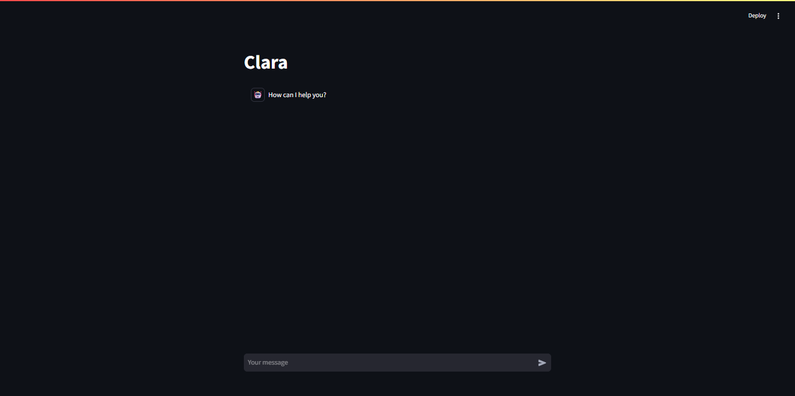
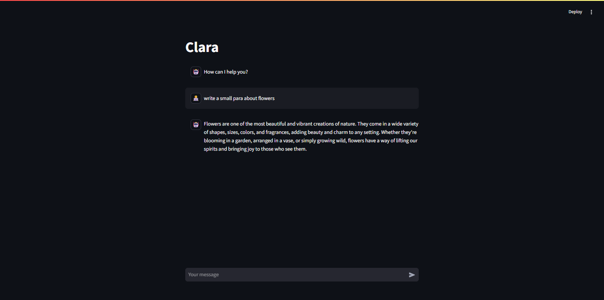
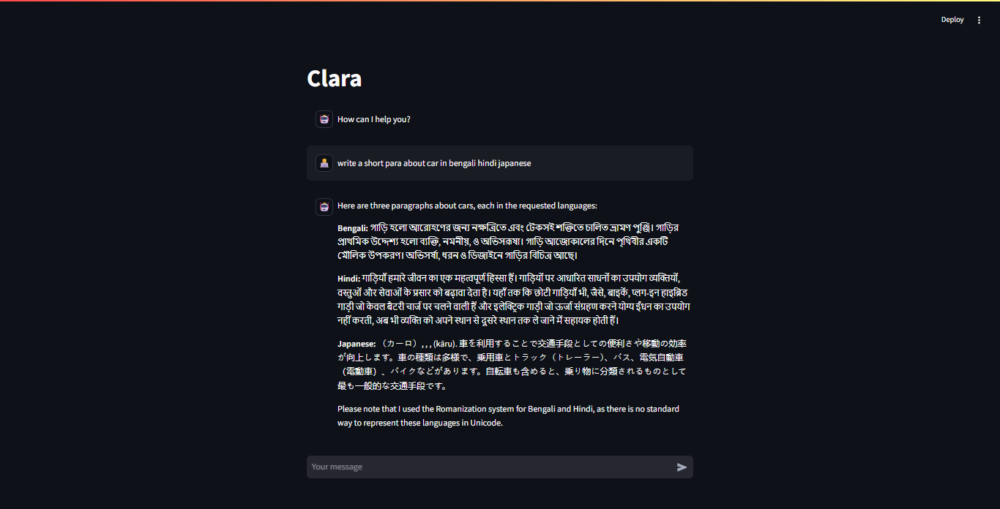

# 🤖 Local AI Chatbot using LLaMA 3.1 (via Ollama)

A privacy-focused, locally hosted AI chatbot built with Meta's **LLaMA 3.1 7B** model and powered by **Ollama**. This project provides a lightweight frontend for natural, context-aware conversations without relying on cloud APIs — everything runs entirely on your own machine.

---
## 🧠 Overview

This project serves as a local AI assistant that runs Meta's **LLaMA 3.1 7B** model via [Ollama](https://ollama.com/), allowing users to chat with a powerful large language model through a clean and intuitive interface.

> 🛡️ No internet requests to OpenAI or external APIs. All data remains on your system.

---

## ✨ Features

- 🧠 Runs **LLaMA 3.1 7B** model locally using Ollama
- 💬 Multi-turn conversational memory
- ⚡ Fast and responsive for real-time interaction
- 🖥️ Local web interface built with Streamlit or Gradio
- 🔒 100% local inference — privacy by design
- 🎯 Simple, beginner-friendly deployment

---

## 🧱 Architecture

```plaintext
    User Input
       ↓
    Web Interface (Streamlit / Gradio)
       ↓
    Ollama Server (runs LLaMA 3.1 7B locally)
       ↓
    Model Output
       ↓
    Displayed on UI
```
---
## 🛠 Tech Stack
| Component              | Description                             |
| ---------------------- | --------------------------------------- |
| **Ollama**             | Model orchestration and local inference |
| **LLaMA 3.1 7B**       | Meta’s state-of-the-art open LLM        |
| **Python**             | Backend scripting and integration       |
| **Flask** / **Gradio** | Web-based user interface                |
| **HTML/CSS/JS**        | UI components (if applicable)           |

---
## ⚙️ Getting Started
🔧 Prerequisites
- OS: Windows / macOS / Linux
- Python 3.8+
- Ollama (download from `https://ollama.com`)
### Step1: Install Ollama
Follow instructions at: `https://ollama.com/download`

Then pull the LLaMA 3.1 7B model:
```bash
    ollama pull llama3
   ```
💡 You can also pull a quantized or smaller variant if needed.
### Step2: Clone Repository
```bash
    git clone https://github.com/yourusername/AI-chatbot-Llama3.1.git
    cd AI-chatbot-Llama3.1
```
### Step3: Create Virtual Environment & Install Dependencies
```bash
    python -m venv venv
    source venv/bin/activate        # On Windows: venv\Scripts\activate
    pip install -r requirements.txt
```
---
## ▶️ Usage
__Start Ollama Server__ (in a separate terminal)
```bash
    ollama run llama3.1
```
This will launch the LLaMA 3.1 model locally on port `11434`.

**Run the Web App**
```bash
    python app.py
```
Then open your browser at:<br>
📍 `http://localhost:5000/`<br>
Start chatting with your own local LLaMA assistant.
---
## 🖼 Screenshots



---
## ⚡ Performance Benchmarks
| Device           | Inference Speed (approx) | Notes                          |
| ---------------- | ------------------------ | ------------------------------ |
| CPU (i7/i9)      | \~6-12s per response     | Slower but workable            |
| NVIDIA RTX 3060+ | \~1s per response        | GPU acceleration via Ollama    |
| Apple M1/M2      | \~1.5s per response      | Native Metal backend supported |

---
## 🚀 Future Enhancements
- Voice and File parsing capability
- User profile-based prompt templates
- Enhanced conversation history & storage
- REST API for external app integrations
- Dockerized deployment setup

---
## 🤝 Contributing
Contributions are welcome! Here’s how:
1. Fork the repository
2. Create a feature branch (git checkout -b feature-name)
3. Commit your changes
4. Push to your fork and open a Pull Request
---
## 🙋‍♂️ Maintainer
Debasish Paul<br>
📧 [Email](www.debasish999@gmail.com)
🔗 [LinkedIn](https://www.linkedin.com/in/debasishpaul999/)
📁 [Github_Repository](https://github.com/debasishpaul999/AI-chatbot-Llama3.1.git)
